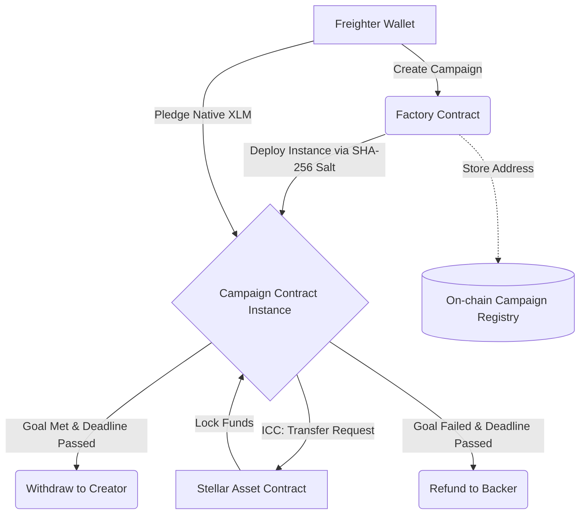

# PledgeVault — Decentralized Crowdfunding on Stellar


[](https://github.com/suurajku-ux/PledgeVaultS/actions/workflows/ci.yml)


PledgeVault is a production-grade, decentralized crowdfunding platform built on the Stellar network using Soroban smart contracts. It empowers individual creators to launch funding campaigns with specific goals and time-bound deadlines, while providing backers with a secure, trustless escrow environment to pledge their support.

This project was built explicitly to fulfill the **Stellar Level 3 Orange Belt** requirements, demonstrating advanced contract logic, inter-contract communication (ICC), real-time event streaming, comprehensive unit testing, and a fully automated CI/CD deployment pipeline.

---

## Architecture Diagram



**Inter-Contract Communication (ICC) Flow:**
PledgeVault utilizes the *Contract-of-Contracts* pattern. The `Factory` contract serves as a master registry and deployment engine, dynamically instantiating isolated `Campaign` contracts for every new project. When a backer pledges, the `Campaign` contract makes cross-contract calls directly to the native **Stellar Asset Contract (SAC)** to securely route and escrow native XLM tokens without requiring the user to send funds directly.

---

## Features

- **Advanced Contract Logic:** Time-bound escrows, goal evaluations, and strict access controls leveraging deterministic contract instantiation.
- **Inter-contract Communication:** Native integration with the SAC for trustless token routing.
- **Real-Time Event Streaming:** Emits typed Soroban events (`campaign_created`, `pledge`, `withdraw`, `refund`) for frontend indexing and notifications.
- **CI/CD Pipeline:** Fully automated GitHub Actions workflow for building Rust WASMs, executing tests, and validating the frontend.
- **Mobile Responsive UI:** Premium glassmorphism design built with Tailwind CSS v4, perfectly scaling from desktop to mobile screens.
- **Robust Error Handling:** Custom contract errors (e.g., `DeadlinePassed`, `GoalNotMet`) are caught and gracefully surfaced in the React UI.
- **High Test Coverage:** 11 combined unit tests (Rust and React) covering every edge case from unauthorized withdrawals to UI modal behavior.

---

## Tech Stack

| Layer | Technology |
|---|---|
| **Smart Contracts** | Rust, Soroban SDK v21.6.0 |
| **Frontend Framework** | React 18, Vite, TypeScript |
| **Styling** | Tailwind CSS v4 (Glassmorphism UI) |
| **Blockchain Integration** | `@stellar/stellar-sdk` v16, `@stellar/freighter-api` v6 |
| **Testing** | `cargo test`, Vitest, React Testing Library |
| **CI/CD** | GitHub Actions |
| **Deployment** | Vercel (Frontend), Soroban CLI (Contracts) |

---

## Repo Structure

```text
PledgeVaultS/
├── .github/
│   └── workflows/
│       ├── ci.yml                 # Automated testing pipeline
│       └── deploy.yml             # Manual Testnet deployment workflow
├── contracts/
│   ├── campaign/                  # Escrow logic, state transitions, ICC
│   │   ├── src/
│   │   │   ├── lib.rs             # Core campaign logic
│   │   │   └── test.rs            # 7 extensive unit tests
│   │   └── Cargo.toml
│   └── factory/                   # Contract deployment engine & registry
│       ├── src/
│       │   └── lib.rs             # Factory logic and deterministic deployments
│       └── Cargo.toml
├── frontend/                      # React SPA
│   ├── src/
│   │   ├── utils/
│   │   │   └── stellar.ts         # Freighter API & Soroban RPC integrations
│   │   ├── App.tsx                # Main dashboard UI
│   │   ├── App.test.tsx           # RTL unit tests
│   │   ├── main.tsx
│   │   └── index.css              # Tailwind v4 configuration
│   └── package.json
├── scripts/
│   └── deploy.ps1                 # Automated deployment & initialization script
├── Cargo.lock                     # Committed to ensure CI/CD reproducibility
├── Cargo.toml                     # Root workspace configuration
└── README.md
```

---

## Smart Contract Details

### `factory` Contract
Acts as the central orchestrator for the platform.
- **Functions:** `create_campaign`, `list_campaigns`
- **Purpose:** Uses deterministic salts to deploy isolated campaigns and maintains a persistent on-chain registry of all active projects.
- **Storage:** Uses `Persistent` storage for the global registry array.

### `campaign` Contract
The core escrow engine handling financial logic for individual projects.
- **Functions:** `initialize`, `pledge`, `withdraw`, `claim_refund`, `get_total_pledged`, `get_status`
- **State Enum:** Tracks status dynamically (e.g., Active, Withdrawn).
- **Custom Errors:** `AlreadyInitialized`, `DeadlinePassed`, `DeadlineNotPassed`, `GoalNotMet`, `GoalWasMet`, `AlreadyWithdrawn`, `Unauthorized`.
- **Events Emitted:**
  - `pledge`: `(backer: Address, amount: i128)`
  - `withdraw`: `(creator: Address, amount: i128)`
  - `refund`: `(backer: Address, amount: i128)`
- **Storage:** Mix of `Instance` storage (for campaign metadata like goal and deadline) and `Persistent` storage (for mapping backer addresses to their pledged amounts).

---

## Setup & Local Development

### Prerequisites
- [Rust](https://www.rust-lang.org/) (with `wasm32-unknown-unknown` target)
- [Stellar CLI](https://developers.stellar.org/docs/build/smart-contracts/getting-started/setup)
- Node.js v22+
- Freighter Wallet Browser Extension

### 1. Build the Smart Contracts
```bash
git clone https://github.com/suurajku-ux/PledgeVaultS.git
cd PledgeVaultS

# Build the WASM binaries
cargo build --target wasm32-unknown-unknown --release
```

### 2. Run Contract Tests
```bash
cargo test --workspace --verbose
```

### 3. Run the Frontend Locally
```bash
cd frontend
npm ci --legacy-peer-deps
npm run dev
```

---

## Deployment

The contracts were deployed using a fresh, dedicated Stellar Testnet account generated specifically for this project.

**Soroban CLI Commands Used:**
```bash
# Generate and fund identity
stellar keys generate pledgevault-deployer
stellar keys fund pledgevault-deployer --network testnet

# Install campaign WASM and deploy factory
stellar contract install --wasm target/wasm32-unknown-unknown/release/pledgevault_campaign.wasm --network testnet --source pledgevault-deployer
stellar contract deploy --wasm target/wasm32-unknown-unknown/release/pledgevault_factory.wasm --network testnet --source pledgevault-deployer
```

### Deployed Contract Addresses

| Component | Address / Hash | Network |
|---|---|---|
| **Deployer Account** | `GATMWRXXLMGIP356DLH2VKPRC2CPCMHLIT62WFA4IQLXPFURRNYSLYYK` | Testnet |
| **Factory Contract** | `CAO7GM5K5KGHTCWCNEU73LOE3D6BJOCW4LZNKGSLBXT3BJOP6NBSXJED` | Testnet |
| **Campaign WASM Hash** | `01af49681f4a58c34d6e28bc0fb5b09b04653040ff2c322ec95c3acf75dba585` | Testnet |
| **Demo Campaign ID** | `CDIOY4OTBM4KK2KLTFYBIGZYTN2KMMIUH2GBRJRTDUTB7YTLAZ5GADSR` | Testnet |

---

## Live Demo & Transaction Proof

- **Live Deployed App:** [https://pledge-vault-s-dt29.vercel.app/](https://pledge-vault-s-dt29.vercel.app/)
- **Stellar Expert (Factory):** [View Factory on Testnet](https://stellar.expert/explorer/testnet/contract/CAO7GM5K5KGHTCWCNEU73LOE3D6BJOCW4LZNKGSLBXT3BJOP6NBSXJED)
- **Stellar Expert (Campaign):** [View Campaign on Testnet](https://stellar.expert/explorer/testnet/contract/CDIOY4OTBM4KK2KLTFYBIGZYTN2KMMIUH2GBRJRTDUTB7YTLAZ5GADSR)

**Transaction Proof:**
- **On-chain Pledge Transaction:** [e0d484af615298978b519b53d40c2d6f00cfcec572640d482d24541d38382983](https://stellar.expert/explorer/testnet/tx/e0d484af615298978b519b53d40c2d6f00cfcec572640d482d24541d38382983)
  *Description: A live 10 XLM pledge made through the frontend interface, seamlessly invoking the ICC transfer function via the SAC.*

---

## Testing

The project implements rigorous automated testing on both the contract and frontend tiers.

**To run all tests:**
```bash
# Contract Tests
cargo test

# Frontend Tests
cd frontend && npm run test
```

### Test Coverage Checklist
**Contract-Side (`test.rs`):**
- [x] `test_successful_pledge`: Verifies goal tracking and token transfer balances.
- [x] `test_withdraw_fails_if_deadline_not_passed`: Tests temporal access controls.
- [x] `test_withdraw_fails_if_goal_not_met`: Tests financial constraints.
- [x] `test_withdraw_succeeds_after_goal_met_and_deadline_passed`: Validates successful creator payouts.
- [x] `test_unauthorized_withdraw_fails`: Ensures only the campaign creator can withdraw funds.
- [x] `test_refund_fails_when_goal_was_met`: Prevents backers from draining successful campaigns.
- [x] `test_refund_succeeds_when_goal_failed`: Ensures trustless return of funds to backers.

**Frontend-Side (`App.test.tsx`):**
- [x] Renders the branding title correctly.
- [x] Displays the Connect Wallet button.
- [x] Triggers empty state variations when the on-chain registry is blank.
- [x] Correctly opens the Create Campaign modal form.

*(See screenshots below for passing test output)*

---

## CI/CD Pipeline

The `.github/workflows/ci.yml` file automates the build and test process for every push and pull request. It executes the following steps:
1. **Rust Toolchain Setup:** Installs the exact `wasm32-unknown-unknown` target.
2. **Cargo Caching:** Caches the registry and build directories to speed up execution.
3. **Smart Contract Verification:** Compiles the WASMs and runs `cargo test` across the workspace.
4. **Node Environment Setup:** Provisions Node 22 for the frontend build.
5. **Frontend Verification:** Runs `npm run test` and `npm run build` to ensure UI stability.

🔗 **[View the latest CI runs in the Actions tab here](https://github.com/suurajku-ux/PledgeVaultS/actions)**

*(See screenshots below for green pipeline run)*

---

## Screenshots

<details>
<summary>Click to view Application Previews</summary>

### Frontend UI (Mobile & Desktop)


### Freighter Transaction Signing


### On-chain Verification (Stellar Expert)


### Passing Unit Tests (Terminal)


### CI/CD Green Pipeline


</details>

---

## Demo Video

📹 **[Watch Demo Video](https://photos.app.goo.gl/hEYAaDZPe7zbgv6b9)**

**Video Outline:**
1. Connecting the Freighter Wallet to the dApp.
2. Initiating a new crowdfunding campaign via the Factory contract.
3. Showcasing a live pledge transaction from a backer account.
4. Demonstrating real-time updates to the campaign's progress bar.
5. Outlining the conditional withdraw/refund flows upon deadline expiration.

---

## Known Limitations / Future Improvements

- **Single Asset Support:** Currently, the smart contract only escrows native XLM. Future versions will support dynamic tokens (e.g., USDC) via arbitrary SAC addresses.
- **No Early Cancellation:** Creators cannot cancel a campaign once it is launched; funds remain locked until the deadline.
- **No Partial Withdrawals:** Milestone-based funding is not currently implemented; creators receive the entire lump sum if the goal is met.
- **Strict Oracles:** Time verification relies entirely on ledger timestamps.

---

## License

This project is licensed under the MIT License.
