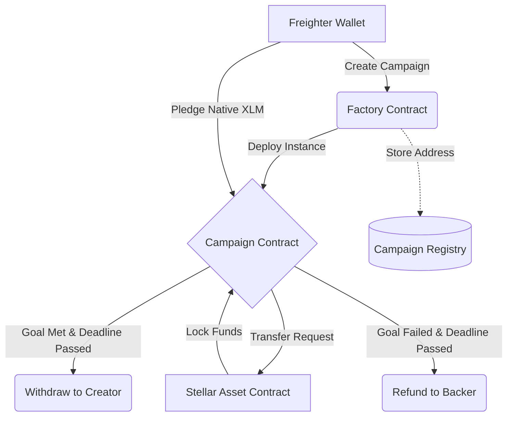

# PledgeVault — Decentralized Crowdfunding on Stellar


PledgeVault is a production-grade, decentralized crowdfunding platform built on the Stellar network using Soroban smart contracts. It allows creators to launch funding campaigns with specific goals and deadlines, and enables contributors to back these projects securely.

---

## 🚀 Live Demo & Resources
- **Live Demo Video:** [Watch on Google Photos](https://photos.app.goo.gl/hEYAaDZPe7zbgv6b9)
- **Deployed Testnet Interface:** [https://crowfunding-dapp-zeta.vercel.app/](https://crowfunding-dapp-zeta.vercel.app/)

---

## 🏗️ Architecture & Features

PledgeVault utilizes an advanced **Contract-of-Contracts** architecture to ensure secure, isolated escrow environments for every campaign.



### Advanced Smart Contract Capabilities
1. **Factory Pattern:** The Factory contract dynamically deploys isolated Campaign contracts upon request using deterministic salts (SHA-256).
2. **Inter-Contract Communication (ICC):** The contracts communicate directly with the native Stellar Asset Contract (SAC) to process trustless XLM transfers, escrows, and refunds.
3. **Soroban Event Streaming:** The contracts emit real-time typed events (`campaign_created`, `pledge`, `goal_reached`, `withdraw`, `refund`) for seamless frontend indexing.
4. **Time-Bound Escrows:** Storage TTL (Time-To-Live) extensions are managed automatically for instances and persistent records.

---

## 🔗 Deployed Contracts (Stellar Testnet)

These contracts are actively deployed on the Stellar Testnet. You can verify them on [Stellar Expert](https://stellar.expert/explorer/testnet).

- **Deployer Account:** `GATMWRXXLMGIP356DLH2VKPRC2CPCMHLIT62WFA4IQLXPFURRNYSLYYK`
- **Factory Contract ID:** `CAO7GM5K5KGHTCWCNEU73LOE3D6BJOCW4LZNKGSLBXT3BJOP6NBSXJED`
- **Campaign WASM Hash:** `01af49681f4a58c34d6e28bc0fb5b09b04653040ff2c322ec95c3acf75dba585`
- **Test Campaign ID:** `CDIOY4OTBM4KK2KLTFYBIGZYTN2KMMIUH2GBRJRTDUTB7YTLAZ5GADSR`

*Test Pledge Transaction Hash: `e0d484af615298978b519b53d40c2d6f00cfcec572640d482d24541d38382983`*

---

## 💻 Tech Stack
- **Smart Contracts:** Rust, Soroban SDK v21.6.0
- **Frontend:** React 18, TypeScript, Vite, Tailwind CSS v4 (Glassmorphism design)
- **Integration:** `@stellar/stellar-sdk` v16, `@stellar/freighter-api` v6
- **CI/CD:** GitHub Actions (Automated testing and verification)

---

## 🧪 Testing

The smart contracts are thoroughly tested with 7 comprehensive unit test cases covering all edge cases (successful pledges, failed withdrawals before deadlines, unauthorized claims, and refund routing).

To run the Rust tests:
```bash
cargo test --workspace --verbose
```

To run the frontend component tests (React Testing Library + Vitest):
```bash
cd frontend
npm install
npm run test
```

---

## 🛠️ Local Development & Deployment

### Prerequisites
- Rust (`wasm32v1-none` target)
- Node.js v22+
- Stellar CLI

### Smart Contract Build
```bash
# Compile contracts to WASM
cargo build --target wasm32v1-none --release
```

### Automated Testnet Deployment
We have provided a comprehensive PowerShell deployment script that automatically generates a new funded testnet identity, deploys the factory and campaign WASMs, and initializes the environment.

```powershell
# Run the deployment script
.\scripts\deploy.ps1
```

### Frontend Setup
```bash
cd frontend
npm ci --legacy-peer-deps
npm run dev
```

---

*Built with ❤️ for the Stellar Soroban Developer Program — Level 3 Orange Belt.*
